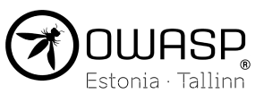

---

layout: col-sidebar
title: OWASP Tallinn
tags: tallinn
region: Europe
country: Estonia
meetup-group:

---

---

---

OWASP® Tallinn is the first OWASP® chapter in Estonia. It was founded and is lead by [Stefano Amorelli](mailto:stefano.amorelli@owasp.org) and [Darja Dovbõš](mailto:darja.dovbos@owasp.org).

## Our mission
Estonia is a leading digital country with strong focus on the importance of cybersecurity.

Our goal is to bring together people who code, security fans, and experts from Estonia and abroad to spread awareness, share ideas, and network.

With hands-on workshops, relevant talks, and networking events, the OWASP Tallinn Chapter wants to create a place where everyone can learn and grow.

We welcome our members to contribute with their skills, share the latest security proceedings, and work together to make Internet a safer place.

Join us in our mission to build a strong cybersecurity mindset and make a difference in Estonia and beyond.

## Participate in OWASP
The Open Worldwide Application Security Project (OWASP) is a nonprofit foundation that works to improve the security of software. All of our projects, tools, documents, forums, and chapters are free and open to anyone interested in improving application security. 

Chapters are led by local leaders in accordance with the [Chapters Policy](/www-policy/operational/chapters). Financial contributions should only be made online using the authorized online donation button. 

Everyone is welcome and encouraged to participate in our [Projects](/projects/), [Local Chapters](/chapters/), [Events](/events/), [Online Groups](https://groups.google.com/a/owasp.com/){:target='_blank'}, and [Community Slack Channel](https://owasp.slack.com/){:target='_blank'}. We especially encourage diversity in all our initiatives. OWASP is a fantastic place to learn about application security, to network, and even to build your reputation as an expert. We also encourage you to be [become a member](/membership/) or consider a [donation](/donate/) to support our ongoing work.

## Next Meeting/Event 
---------------------
We'll be annoucing our first event soon. Stay tuned!

